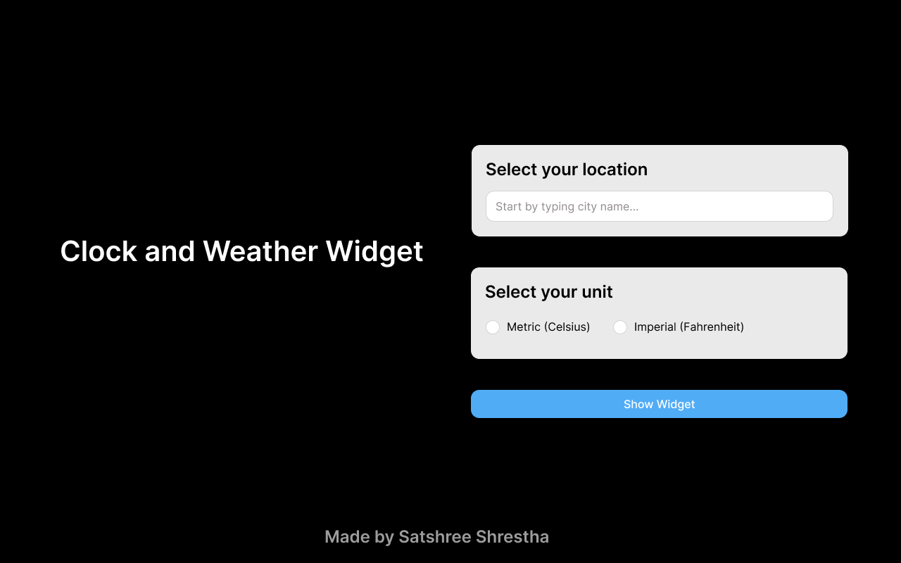
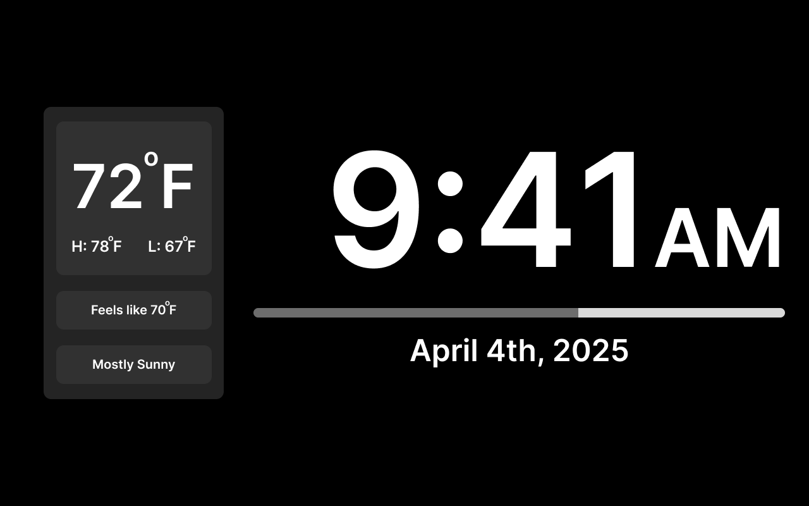

# clock-dashboard

Use any of your leftover devices (tablets/2-in-1) or televisions as signage display for a clock and weather widget dashboard.

---

Built using React Native Expo for cross platform compatibility

    Currently supports,

    [x] Web

    [ ] Android

    [ ] iOS

    [ ] Desktop (macOS/Windows/Linux)

## Design

[Figma](./assets/screenshots/v2/figma.pdf)

